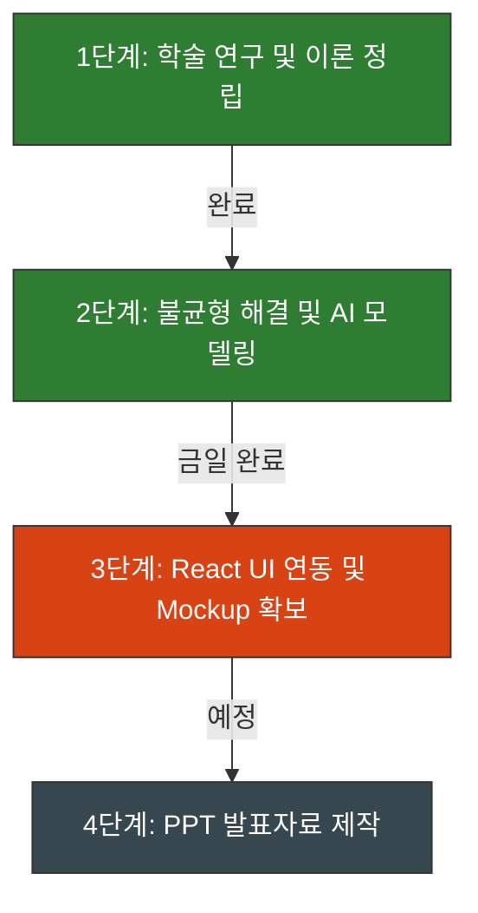

# 🗺️ AI Modeling & System Integration Overall Implementation Plan (0603_report)

본 문서는 서울시 상권 과포화도 및 개별 점포 폐업 위험도 예측 시스템의 **기획 단계부터 최종 발표자료 준비까지의 전체 로드맵**과 **현재까지의 구체적인 진행 현황**을 한눈에 볼 수 있도록 정리한 종합 계획서입니다. (PPT 장표 구성 시 흐름도로 활용 가능)

---

## 📌 1. 전체 프로젝트 로드맵 요약 (Overall Roadmap)

* **1단계 (학술 연구 및 이론 정립)**: `[x] 완료`
* **2단계 (불균형 해결 및 AI 모델링)**: `[x] 완료` (금일 완료)
* **3단계 (React UI 연동 및 Mockup 확보)**: `[/] 진행 중` (다음 단계)
* **4단계 (PPT 발표자료 제작)**: `[ ] 대기`

---

## 📂 2. 단계별 상세 진행 현황 (Step-by-Step Progress)

### 🟢 1단계: 학술 연구 및 이론 정립 (Step 1: Academic Foundation)
* **목표**: 3% 극심한 클래스 불균형 해결 방식과 모델 성능 평가지표의 학술적 타당성 확보.
* **진행 내용**:
  * 일반적인 Accuracy나 ROC-AUC 지표의 왜곡 가능성을 지적하고, 소수 클래스 탐지력을 대변하는 **PR-AUC (Precision-Recall AUC)** 및 **소수 클래스 F1-Score**를 대표 지표로 설정.
  * 설명 가능한 AI인 **SHAP (Shapley Additive exPlanations)** 이론 도입.
  * 확률값($p$)을 위험 지수(Risk Score)로 신뢰성 있게 맵핑하기 위한 **Log-odds 기반 신용평가 통계 공식** 채택.
* **관련 문서**: [docs/academic_references.md](file:///e:/capstone/kw-capstone-2026/docs/academic_references.md), [docs/team_work_comparison.md](file:///e:/capstone/kw-capstone-2026/docs/team_work_comparison.md)

### 🟢 2단계: 데이터 전처리 & AI 모델링 완성 (Step 2: Preprocessing & Modeling)
* **목표**: 불균형 데이터 처리 기법별 성능 비교 및 최적 앙상블 모델 완성, 모델 가중치 및 XAI 시각화 파일 추출.
* **진행 내용 (2026-06-03 완료)**:
  * **샘플링 비교 실험**: SMOTE, RUS, Hybrid 기법을 적용하여 모델 학습 후 원본 테스트셋으로 검증. (결과: 오버샘플링 시 노이즈 발생으로 인해 **원본 가중치 조정 방식이 PR-AUC 0.3171로 최적임**을 확인)
  * **위험 점수 수식 구현**: Log-odds 기반 스케일링 기법을 이용해 고위험 점포(94.76% 확률 $\rightarrow$ 93점), 저위험 점포(19.29% 확률 $\rightarrow$ 29점) 점수 변환 완료.
  * **SHAP 고화질 시각화**: 마이너스 기호가 사각형으로 깨지던 버그를 패치(Glyph 8722 우회)하고 차트 3종을 고해상도로 재생성 완료.
  * **가중치 파일 내보내기**: `xgb_model.json`, `lgb_model.txt`, `feature_cols.json` 파일 추출 완료.
* **관련 파일/문서**:
  * 실험 및 점수 리포트: [docs/0603_report/experiment_results_summary.md](file:///e:/capstone/kw-capstone-2026/docs/0603_report/experiment_results_summary.md)
  * 실행 스크립트: [run_sampling_experiments.py](file:///e:/capstone/kw-capstone-2026/src/models/run_sampling_experiments.py), [calculate_risk_score.py](file:///e:/capstone/kw-capstone-2026/src/models/calculate_risk_score.py), [explain_model_shap.py](file:///e:/capstone/kw-capstone-2026/src/models/explain_model_shap.py), [train_and_save_models.py](file:///e:/capstone/kw-capstone-2026/src/models/train_and_save_models.py)
  * 모델 저장 경로: [ml-server/](file:///e:/capstone/kw-capstone-2026/ml-server/)

### 🟠 3단계: React UI 연동 및 Mockup 확보 (Step 3: Frontend Mockup) - [현재 단계]
* **목표**: 실제 구동되는 대시보드 웹 화면의 고화질 캡처본(Screenshot)을 확보하여 PPT 장표에 시연 화면으로 활용.
* **상세 계획**:
  * **시나리오 사례 선정**: 분석 대상이 될 고위험 점포(93점), 안전 점포(29점), 경계 점포 3개 데이터셋 준비.
  * **React 데이터 바인딩**: `feature/frontend-components` 브랜치의 React 코드 중 [Prediction.jsx](file:///e:/capstone/kw-capstone-2026/src/pages/Prediction.jsx)에 이 3가지 사례의 데이터(위도/경도, 위험지수 점수, 피처별 SHAP 기여도 변수)를 정적으로 바인딩(하드코딩).
  * **로컬 브라우저 구동 및 캡처**: 웹 화면을 로컬 브라우저에 띄우고 지도 시각화, 게이지 차트, Recharts 기반 SHAP 기여도 막대그래프(위험 요인은 빨간색, 안전 요인은 파란색)를 고화질로 캡처하여 저장.
  * **관련 가이드**: [docs/0603_report/frontend_mock_data_guide.md](file:///e:/capstone/kw-capstone-2026/docs/0603_report/frontend_mock_data_guide.md), [docs/0603_report/frontend_mock_patch_guide.md](file:///e:/capstone/kw-capstone-2026/docs/0603_report/frontend_mock_patch_guide.md)

### 🔴 4단계: PPT 발표자료 최종 제작 (Step 4: Presentation Synthesis) - [대기]
* **목표**: 졸업작품 심사를 통과하기 위한 슬라이드 구성 및 연습.
* **상세 계획**:
  * **장표 구성**: 서론(3% 불균형 극복과 PR-AUC 도입 당위성) $\rightarrow$ 본론(앙상블 모델 성능 테이블 및 Log-odds 스케일링 수식) $\rightarrow$ 결론(SHAP 시뮬레이션 및 React 시연 Mockup 화면 배치 및 요인별 비즈니스적 1:1 진단 해석).
  * **참고문헌 인용**: 학술적 타당성 강화를 위해 1단계에서 조사한 논문 명세를 슬라이드 하단에 기입.
