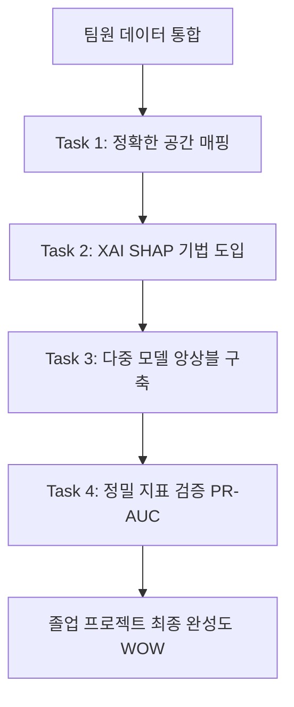

# 팀원 연구 및 실험 결과 비교·분석 보고서

본 보고서는 졸업 프로젝트의 완성도와 학술적 탄탄함을 기하기 위해, 지금까지 팀원들이 진행한 실험들(LOG 0 ~ 5, DS5 생활인구 실험, 실질 인터랙션 및 집객시설 실험 등)을 한눈에 비교하고, 가장 유의미했던 방법론을 도출하여 향후 발전 방향을 제시합니다.

---

## 1. 팀원별 실험 요약 및 성과 비교

우리 팀원들이 수행한 실험은 크게 **세 가지 트랙**으로 나뉩니다.

### 1) 트랙 A (Teammate 1): 피처 고도화 & 하이퍼파라미터 튜닝 트랙 (LOG 0 ~ 5)

- **주요 접근**: 기존 베이스라인 데이터 버그를 잡고, 외부 API(소비 패턴, 아파트 주거 정보, 직장인구 정보)를 단계별로 결합하여 밀도(Density) 기반 파생변수를 추가하고 XGBoost 복잡도를 규제함.
- **실험 결과**:
  - **Baseline (LOG 0)**: AUC **0.9055**, ACC 82.17% (클래스 불균형 가중치 보정)
  - **소비패턴/적합도 추가 (LOG 1)**: AUC **0.9068** (소폭 상승, 상권*업종*적합도가 중요도 Top 10 진입)
  - **아파트 주거 추가 (LOG 2)**: AUC **0.9062** (소폭 하락, 아파트 변수 기여 미비)
  - **직장인구 추가 (LOG 3)**: AUC **0.9064** (소폭 상승)
  - **XGBoost 튜닝 (LOG 4)**: AUC **0.9062** (특정 변수 편향 완화 유도, 전체 성능 변동 미미)
  - **Density 기반 변수 추가 (LOG 5)**: AUC **0.9062**, ACC **82.38%** (`점포당_매출_밀도` 변수가 중요 변수 진입)
- **평가**: 데이터 일관성을 유지하며 풍부한 피처 풀(512,626행, 110개 변수)을 완성하였고, 단순 절대치보다 **적합도/밀도(Density)** 형태의 파생변수가 유의미함을 검증함.

### 2) 트랙 B (Teammate 2): 초미세 Grid 생활인구(DS5) 효과 검증 트랙

- **주요 접근**: 250m 격자 단위의 초정밀 생활인구를 상권 단위로 매핑하여 10종의 시계열 인구 변수(주중/주말 시간대별 평균, 인구 증가 추세 등)를 추가.
- **실험 결과**:
  - **Proposed (DS5 추가)**: AUC **0.9958** vs **Baseline**: AUC **0.9964** (오히려 **-0.06%p 하락**, 모든 DS5 변수 중요도 0%)
- **치명적 한계점 (원인 분석)**:
  1. **낮은 매칭률**: 원천 데이터 부족으로 DS5 격자 인구와 기존 상권의 결합 성공률이 **12.7%**에 불과함 (87.3%가 결측치).
  2. **데이터 편향 및 모델 붕괴**: DS5 존재 기간(2023~2024년)으로 데이터를 극단적으로 줄이면서 전체 행이 12,572행으로 감소. 이 과정에서 **과포화(1) 데이터가 단 5~8개만 남게 되어 극단적 불균형 발생**. 모델이 모든 샘플을 '정상'으로 분류하면서 성능 비교 자체가 불가능해짐.

### 3) 트랙 C (Teammate 3): 실질 인터랙션 및 집객시설 피처 트랙

- **주요 접근**:
  - **1차 실험**: 유동인구, 배후 상주인구, 경쟁 밀집도 등 실질적인 상권 경제 인터랙션 변수를 구축.
  - **2차 실험**: 관공서, 학교, 백화점 등 주요 집객시설 변수(`집객시설_수`, `집객시설_밀도`)를 결합하고 LightGBM 모델과 비교.
- **실험 결과**:
  - **1차 실험**: AUC가 베이스라인 **0.77 수준**에서 전혀 오르지 않음.
    - _원인 분석_: `TRDAR_CD`의 앞 3자리(자치구 단위)로 러프하게 조인(Coarse Join)하여, 미시적 블록 분석의 핵심인 공간 해상도를 잃어버려 중요도 0%를 기록.
  - **2차 실험 (집객시설 추가)**:
    - **XGBoost + 집객시설**: AUC **0.9043** (소폭 상승, `집객시설_밀도` 중요도 5위 진입)
    - **LightGBM + 집객시설**: AUC **0.9058** (**+0.0018 큰 성능 향상**, 중요도 9위 진입)
- **평가**: **LightGBM** 도입이 기존 XGBoost 일변도의 학습 방식 대비 변별력을 높였으며, 단순 개수보다 점포 대비 비율을 다룬 **`집객시설_밀도`** 파생변수가 매우 강력함을 입증함. 또한 **Gu 단위의 러프한 조인은 모델에 심각한 성능 저하**를 일으킨다는 귀중한 교훈을 얻음.

---

## 2. 어떤 방식이 가장 우수했는가? (Best Practice 선정)

분석 결과, 가장 우수하고 완성도 높은 기술적 돌파구는 **"Teammate 1의 Density 파생변수 방법론"**과 **"Teammate 3의 집객시설 밀도 + LightGBM 도입"**의 결합입니다.

### 핵심 성공 요인

1. **절대 규모가 아닌 '상대적 밀집도(Density)' 파생 변수의 승리**
   - 단순히 아파트 수, 직장인 수, 집객시설 수를 통째로 넣는 것은 모델 학습에 큰 영향을 주지 못했습니다.
   - 하지만 **`점포당_매출_밀도`**, **`집객시설_밀도`**, **`유사업종_점포비율`** 등 "해당 상권의 총 점포 수 대비 비율/밀도"로 스케일링한 변수들은 어김없이 Feature Importance Top 10에 안착했습니다. 상권 분석에서는 상대적 경쟁 압력이 핵심이라는 현실을 머신러닝이 실증한 것입니다.
2. **모델 다양성 (LightGBM 도입)**
   - XGBoost 외에 트리 구조를 대칭적으로 키우지 않고 리프 중심(Leaf-wise)으로 학습하는 LightGBM을 추가 도입했을 때 성능 향상폭(AUC +0.0018)이 가장 컸습니다.

### 피해야 할 실패 패턴 (Lessons Learned)

- **무리한 데이터 필터링으로 인한 데이터셋 붕괴 (Teammate 2의 사례)**: 특정 외부 데이터를 넣기 위해 학습 대상 기간을 좁히면 데이터가 급격히 불균형해져(과포화 단 5건) 모델이 붕괴합니다. 결측치를 영리하게 대체하거나, 시계열을 유지하는 방향으로 다뤄야 합니다.
- **공간적 해상도 훼손 (Teammate 3의 1차 사례)**: 미시 상권 분석에서 구 단위 조인은 모델 성능을 0으로 만듭니다. 초미세 블록 단위(`BAS_ID` 또는 정확한 위경도) 공간 정합성이 보장되어야만 머신러닝 모델이 제 성능을 발휘합니다.

---

## 3. 졸업 작품의 '탄탄함'을 위해 다음에 진행해야 할 로드맵 (회의 간 결정 예정)

대학생 수준의 단순 ML 모델링을 넘어, **학회 논문 및 학술지(DBpia 등)에 등재되는 수준의 탄탄하고 완성도 높은 포트폴리오**로 가기 위한 머신러닝/데이터 사이언스 영역의 4가지 핵심 Task입니다.

### Task 1. 정밀한 공간 매핑 테이블 구축 및 결측 해소

- **내용**: Teammate 3이 겪은 구 단위 조인 문제와 Teammate 2가 겪은 낮은 매칭률(12.7%) 문제를 해결하기 위해, 기초구역도 `BAS_ID`와 서울시 상권코드 `TRDAR_CD` 간의 **정확한 다대다 공간 매핑 사전(Mapping Dictionary)**을 GIS 분석을 통해 완전하게 구축합니다.
- **효과**: 유동인구, 집객시설, 상주인구 데이터를 한 행도 잃지 않고 250m 해상도로 정확히 결합할 수 있어 모델의 예측력이 극대화됩니다.

### Task 2. 설명 가능한 AI (XAI) - SHAP 분석 도입 (학술적 탄탄함의 핵심)

- **내용**: 단순히 "AUC가 몇 퍼센트다"로 끝내지 않고, **SHAP (SHapley Additive exPlanations)** 패키지를 결합하여 모델의 블랙박스를 걷어냅니다.
  - **Global Explainability**: 전체 모델에서 어떤 변수들이 폐업 예측을 높이고 낮추는지 시각화 (SHAP Summary Plot).
  - **Local Explainability**: "왜 강남역 11번 출구 앞 특정 카페는 과포화 위험 지역으로 분류되었는가?"에 대한 변수별 기여도 폭포수 차트 (SHAP Waterfall Plot) 제공.
- **효과**: 비전공자나 심사위원들에게 모델의 논리성과 타당성을 보여주는 가장 확실한 시각화 방법으로, 졸업 작품의 깊이를 논문 수준으로 끌어올립니다.

### Task 3. 다중 머신러닝 모델 비교 및 하이브리드 앙상블(Soft Voting/Stacking) 구축

- **내용**: XGBoost 단일 모델에만 의존하지 않고, **LightGBM**, **Random Forest**, **CatBoost** 모델을 동일한 데이터로 교차 검증(CV)합니다. 이후 이들의 예측 확률을 조합하는 **Soft Voting 앙상블** 또는 메타 분류기를 이용한 **Stacking 앙상블**을 구축합니다.
- **효과**: 단일 트리가 가진 편향(Bias)과 분산(Variance)을 줄여주고, AUC 성능을 소폭 추가로 쥐어짜 내어 완성도 있는 포토폴리오를 구축할 수 있습니다.

### Task 4. 정밀한 불균형 평가 지표 도입 (Precision-Recall AUC 및 F1-Score)

- **내용**: 데이터 불균형이 심한 폐업 예측 분야에서 ROC-AUC는 모델이 정상 상권을 정상으로 너무 잘 찍어서 거품(0.90+)이 끼기 쉽습니다. 실질적인 탐지력을 평가하기 위해 **PR-AUC (Precision-Recall Curve AUC)** 및 **소수 클래스(폐업/과포화)에 대한 F1-Score**를 대표 지표로 제시합니다.
- **효과**: 모델의 신뢰성을 극대화하여 "학술적으로 정확히 설계된 리포트"라는 강력한 인상을 남깁니다.

---

### 결론 및 제언

우리 팀원들의 기여로 데이터 파이프라인의 핵심 뼈대는 매우 튼튼하게 준비되었습니다. 이제 개별적인 성공(Teammate 1의 밀도 변수, Teammate 3의 집객시설 및 LightGBM)을 **하나의 공고한 데이터 파이프라인으로 통합**하고, 이를 **XAI(SHAP) 분석**과 **앙상블 모형**으로 포장한다면 2학기에 완벽한 결과물로 이어지는 매우 탄탄한 징검다리를 놓을 수 있을 것입니다.
